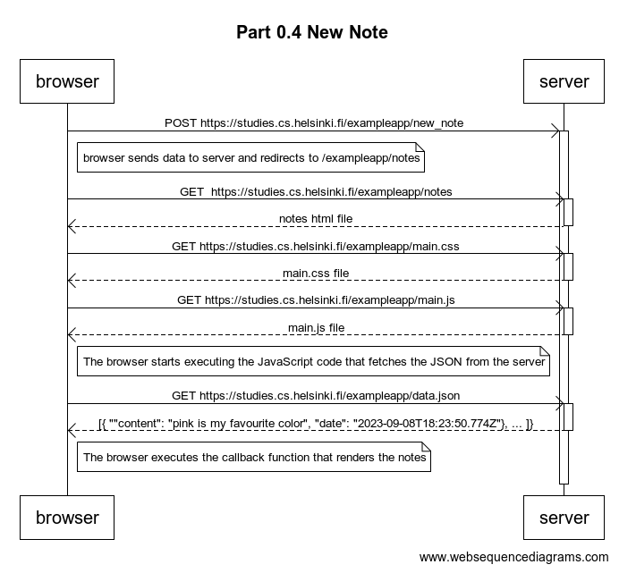
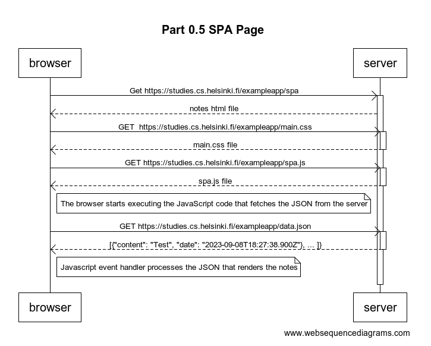

# FSO-Part0

Parts 1-3 are just readings so there is no submission for them

### Part 4 Mermaid Text for diagram
    title Part 0.4 New Note
        participant browser
        participant server

    browser->>server: POST https://studies.cs.helsinki.fi/exampleapp/new_note
    activate server
    note right of browser: browser sends data to server and redirects to /exampleapp/notes

    browser->>server: GET  https://studies.cs.helsinki.fi/exampleapp/notes
    activate server
    server-->>browser: notes html file
    deactivate server

    browser->>server: GET https://studies.cs.helsinki.fi/exampleapp/main.css
    activate server
    server-->>browser: main.css file
    deactivate server
    
        browser->>server: GET https://studies.cs.helsinki.fi/exampleapp/main.js
    activate server
    server-->>browser: main.js file
    deactivate server

    Note right of browser: The browser starts executing the JavaScript code that fetches the JSON from the server

    browser->>server: GET https://studies.cs.helsinki.fi/exampleapp/data.json
    activate server
    server-->>browser: [{ ""content": "pink is my favourite color", "date": "2023-09-08T18:23:50.774Z"}, ... ]}
    deactivate server

    Note right of browser: The browser executes the callback function that renders the notes   

### Part 5 Mermaid Text for diagram
    title Part 0.5 SPA Page
        participant browser
        participant server

    browser->>server: Get https://studies.cs.helsinki.fi/exampleapp/spa
    activate server
    server-->>browser: notes html file

    browser->>server: GET  https://studies.cs.helsinki.fi/exampleapp/main.css
    activate server
    server-->>browser: main.css file
    deactivate server

    browser->>server: GET https://studies.cs.helsinki.fi/exampleapp/spa.js
    activate server
    server-->>browser: spa.js file
    deactivate server
    
    
    Note right of browser: The browser starts executing the JavaScript code that fetches the JSON from the server

    browser->>server: GET https://studies.cs.helsinki.fi/exampleapp/data.json
    activate server
    server-->>browser: [{"content": "Test", "date": "2023-09-08T18:27:38.900Z"}, ... ]}
    deactivate server

    Note right of browser: Javascript event handler processes the JSON that renders the notes       

